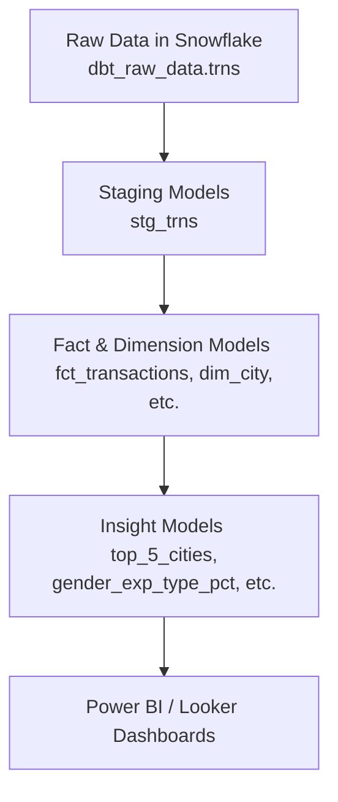

# 💳 End-to-End dbt + Snowflake Data Pipeline: Credit Card Analytics Project

**Enterprise-Scale Modern Data Stack with dbt, Snowflake & CI/CD**


---

## 📌 Project Overview

This project simulates a modern analytics engineering pipeline using **dbt with Snowflake**, built to extract deep insights from credit card transactions.

Data is transformed and modeled using **best practices** in dbt: modular models, testing, documentation, CI/CD automation, and production-grade business metrics.

---

## 🧰 Tech Stack

* **Snowflake** – Cloud-native data warehouse
* **dbt (Data Build Tool)** – Transformation, testing, documentation
* **GitHub Actions** – CI/CD pipeline for automated dbt runs
* **Power BI / Looker** – Visualization layer
* **Mermaid.js** – For diagrams

---

## 🔁 End-to-End Workflow



---

## 🧾 Raw Source Table: `dbt_raw_data.trns`

| Column Name        | Description                                   |
| ------------------ | --------------------------------------------- |
| `transaction_id`   | Unique identifier of transaction              |
| `transaction_date` | Date of transaction                           |
| `card_type`        | Type of card used (Gold, Signature, Platinum) |
| `exp_type`         | Type of expense (e.g., Bills, Fuel)           |
| `gender`           | Gender of cardholder (M/F)                    |
| `city`             | City of transaction                           |
| `amount`           | Spend amount                                  |

---

## 🧱 dbt Modeling Layers

| Layer          | Description                        | Example Models                             |
| -------------- | ---------------------------------- | ------------------------------------------ |
| **Staging**    | Clean and rename raw fields        | `stg_trns`                                 |
| **Dimensions** | Lookup or descriptive data         | `dim_city`, `dim_card_type`, `dim_gender`  |
| **Fact**       | Core transaction data              | `fct_transactions`                         |
| **Insights**   | Business logic answering questions | `top_5_cities`, `weekend_efficiency`, etc. |

---

## 💡 Business Questions Answered (Insight Models)

| 📄 File Name                    | Question                                                           |
| ------------------------------- | ------------------------------------------------------------------ |
| `top_5_cities.sql`              | Top 5 cities with highest spends and % of total                    |
| `monthly_spend_by_card.sql`     | Highest spend month and amount by card type                        |
| `cumulative_card_milestone.sql` | When each card type hits ₹1M cumulative spend                      |
| `lowest_gold_city.sql`          | City with lowest spend % for Gold card                             |
| `city_expense_comparison.sql`   | Highest vs. lowest expense type by city                            |
| `gender_exp_type_pct.sql`       | % spend by females for each expense type                           |
| `highest_mom_growth.sql`        | Card + expense combo with max MoM growth in Jan 2014               |
| `weekend_efficiency.sql`        | City with highest weekend spend-to-transaction ratio               |
| `fastest_city_500.sql`          | City that reached 500 transactions the fastest after its first one |

> 📁 These models are now saved in `models/marts/insights/` and built as dbt models!

---

## 🗂️ Folder Structure

```
📦 dbt_credit_card_project/
│
├── models/
│   ├── staging/                      # stg_trns.sql
│   ├── marts/
│   │   ├── core/                     # fct_transactions
│   │   ├── dimensions/               # dim_city, dim_card_type, dim_gender
│   │   └── insights/                 # Business logic models
│   │       ├── top_5_cities.sql
│   │       ├── monthly_spend_by_card.sql
│   │       ├── cumulative_card_milestone.sql
│   │       └── ...
│
├── macros/                          # Custom macros (if any)
├── seeds/                           # CSV-based seed data (optional)
├── snapshots/                       # For SCD Type-2 snapshots (if used)
├── analyses/                        # Exploratory SQLs (non-materialized)
├── dashboards/                      # Dashboard images
├── .github/workflows/              # CI/CD pipeline config
├── dbt_project.yml                  # dbt project config
└── README.md                        # ← You're here
```

---

## 🧪 Run dbt Locally

```bash
# Clone the project
git clone https://github.com/<your_handle>/dbt_credit_card_project.git
cd dbt_credit_card_project

# Update your Snowflake profile in ~/.dbt/profiles.yml

# Build the pipeline
dbt deps
dbt seed        # Optional
dbt run         # Build models
dbt test        # Run tests
dbt docs generate
dbt docs serve
```

---

## 🔄 CI/CD Automation with GitHub Actions

| Feature         | Status      |
| --------------- | ----------- |
| ✅ Model Linting | ✔️ Enabled  |
| ✅ Unit Testing  | ✔️ Enabled  |
| ✅ Auto Docs     | ✔️ Optional |
| ✅ Deployment    | ✔️ Enabled  |

📁 Config file: `.github/workflows/dbt-ci.yml`

---

## 📊 Sample Dashboard Visuals

| Overview                                             | Monthly Growth                         |
| ---------------------------------------------------- | -------------------------------------- |
|  |  |

---

## 📈 Business Value

| Feature                | Benefit                                  |
| ---------------------- | ---------------------------------------- |
| 🔎 Modular Modeling    | Easy to maintain & scale                 |
| 📊 Insight Delivery    | Critical KPIs delivered to BI tools      |
| 🚀 CI/CD Automation    | Faster, more reliable deployments        |
| 🧪 Testing & Docs      | Data quality + team understanding        |
| 🧩 Reusable Components | Can extend to other finance data sources |

---

## 💬 Analytical Philosophy

> **"Data pipelines shouldn't be black boxes. Good data products are transparent, tested, and tell a business story."**
> — *Avinash Analytics*

---

## 📫 Contact Me

* **Email**: [masteravinashrai@gmail.com](mailto:masteravinashrai@gmail.com)
* **LinkedIn**: [Avinash Analytics](https://www.linkedin.com/in/avinashanalytics/)
* **Twitter (X)**: [@AvinashAnalytiX](https://x.com/AvinashAnalytiX)

